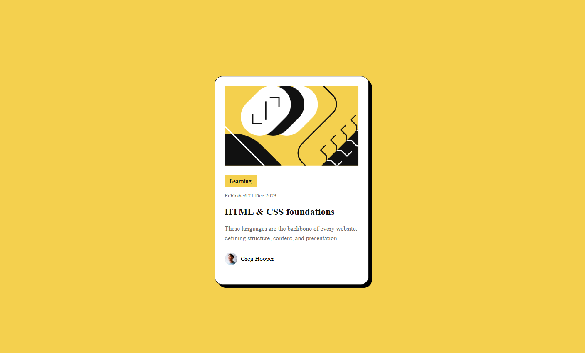

# Frontend Mentor - Blog preview card solution

This is a solution to the [Blog preview card challenge on Frontend Mentor](https://www.frontendmentor.io/challenges/blog-preview-card-ckPaj01IcS). Frontend Mentor challenges help you improve your coding skills by building realistic projects. 

## Table of contents

- [Overview](#overview)
  - [The challenge](#the-challenge)
  - [Screenshot](#screenshot)
  - [Links](#links)
- [My process](#my-process)
  - [Built with](#built-with)
  - [What I learned](#what-i-learned)
  - [Continued development](#continued-development)
  - [Useful resources](#useful-resources)
- [Author](#author)
- [Acknowledgments](#acknowledgments)

**Note: Delete this note and update the table of contents based on what sections you keep.**

## Overview

### The challenge

Users should be able to:

- See hover and focus states for all interactive elements on the page

### Screenshot

### Links

- Live Site URL: [vercel](https://blog-preview-card-main-eight-tawny.vercel.app/)

## My process

### Built with

- Semantic HTML5 markup
- CSS custom properties
- Flexbox
- CSS Grid
- Media Queries

## Author

- Frontend Mentor - [@nik-p12](https://www.frontendmentor.io/profile/nik-p12)

## Acknowledgments

- [MDN Web Docs](https://developer.mozilla.org/) for comprehensive documentation and examples on HTML and CSS.
- [CSS-Tricks](https://css-tricks.com/) for their in-depth guides on Flexbox and responsive design techniques.
- [Responsive-design](//https://www.w3schools.com/html/html_responsive.asp) for documentation and example on responsive web design
- [Flex-box](https://flexboxfroggy.com/#fr) for providing basis knowledge on flex-box by a learning by doing method.
